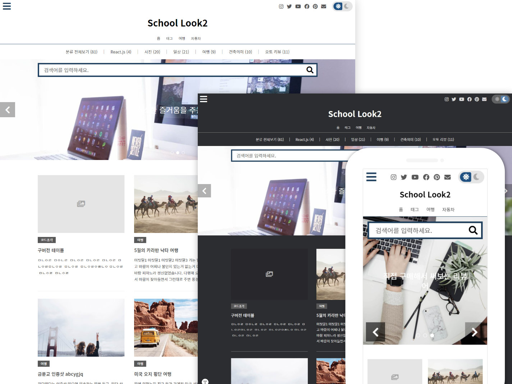

# Tistory Responsive Skin - 123. SchoolLook2

*SchoolLook2 is a skin for Kakao Tistory Blog Service. You can [preview the skin to see what it looks like](http://template2.github.io/html/preview123a.html), or (http://template2.github.io/html/preview123b.html).*

## How to regist skin

To Apply the SchoolLook2 skin:

1. Upload all included files through Tistory skin register:

    /*.*
    /images/*.*

2. Apply registered skin.

    For more skin apply information, see this page:
    https://blogpack.tistory.com/930

## Skin option setup

This skin has more than 90 option items.

## Roadmap

See the [open issues](https://github.com/template2/123_SchoolLook2/issues) for a list of proposed features (and known issues).
